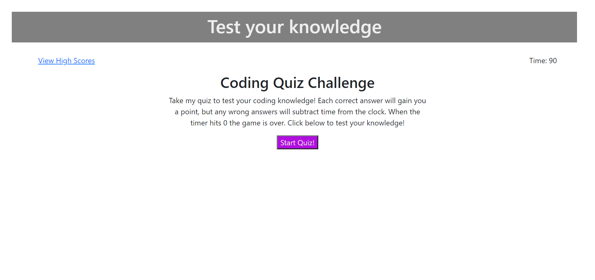
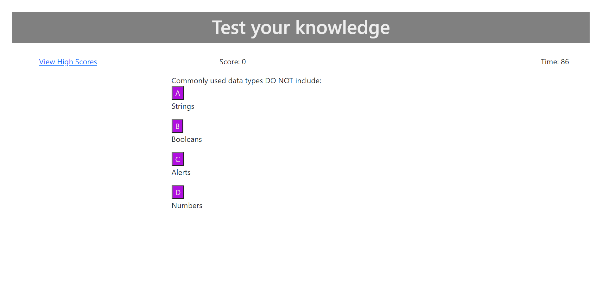
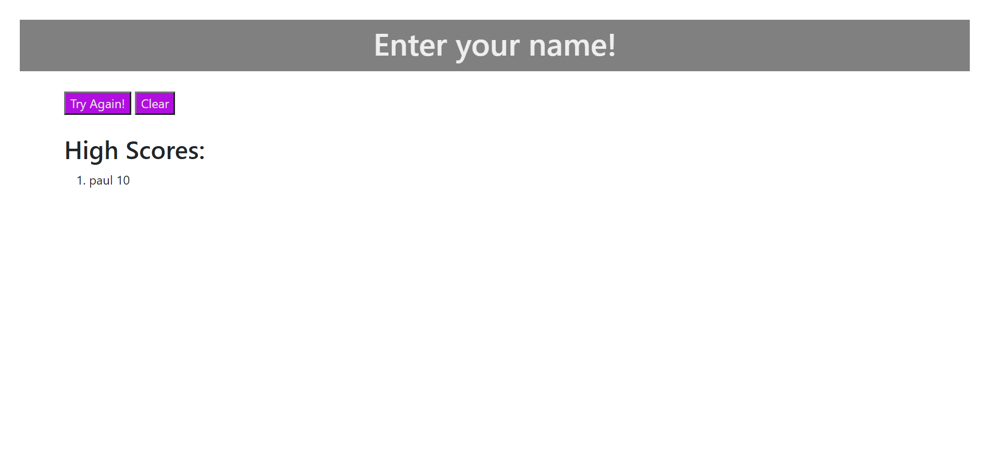

# coding_quiz

For this project, I created a coding quiz website from scratch. This is the first site that I have incorporated javascript on, and it uses script to manipulate the DOM. I started with a fairly basic site. After I had the bones of my site created with html, I used javascript to make dynamic elements within the document. 

Once the start button is pressed, a series of questions with answer choices appear. Each question is added to the page and removed after an answer is chosen. If the question is answered correctly, 10 points are added to your score, but if you choose the wrong answer, 10 seconds are deducted from the built in timer. After all the questions are answered or you run out of time, you will be redirected to a highscores page. On this page, I used javascript to create dynamic input fields and buttons. I also used the local storage of the site to add the player's score to the highscores list and save it there. It can be cleared as well with the clear button.

This project helped me gain valuable experience with javascript. I am now able to add and remove elements to html with only script. The use of javascript also made the page much more interactive and interesting for the end user. I have inclued the links to the git reposity and deployed sites below, as well as a screenshot of the deployed site and highscores page.

Repository:
https://github.com/ejsmith13/coding_quiz

Deployed site:
https://ejsmith13.github.io/coding_quiz

Copyright (c) 2021 Ethan Smith

Permission is hereby granted, free of charge, to any person obtaining a copy
of this software and associated documentation files (the "Software"), to deal
in the Software without restriction, including without limitation the rights
to use, copy, modify, merge, publish, distribute, sublicense, and/or sell
copies of the Software, and to permit persons to whom the Software is
furnished to do so, subject to the following conditions:

The above copyright notice and this permission notice shall be included in all
copies or substantial portions of the Software.

THE SOFTWARE IS PROVIDED "AS IS", WITHOUT WARRANTY OF ANY KIND, EXPRESS OR
IMPLIED, INCLUDING BUT NOT LIMITED TO THE WARRANTIES OF MERCHANTABILITY,
FITNESS FOR A PARTICULAR PURPOSE AND NONINFRINGEMENT. IN NO EVENT SHALL THE
AUTHORS OR COPYRIGHT HOLDERS BE LIABLE FOR ANY CLAIM, DAMAGES OR OTHER
LIABILITY, WHETHER IN AN ACTION OF CONTRACT, TORT OR OTHERWISE, ARISING FROM,
OUT OF OR IN CONNECTION WITH THE SOFTWARE OR THE USE OR OTHER DEALINGS IN THE
SOFTWARE.